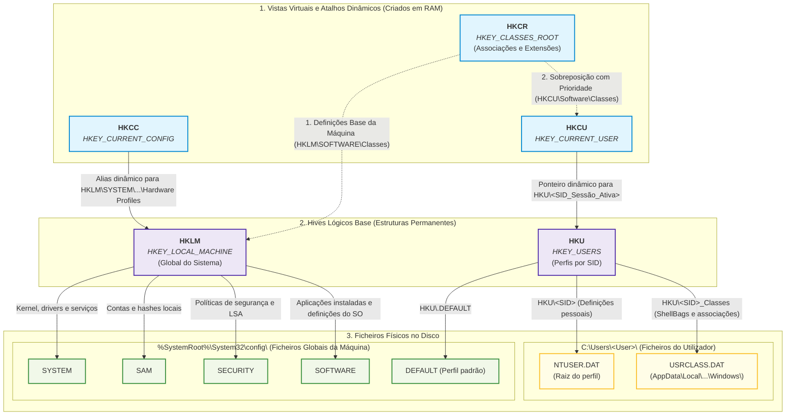
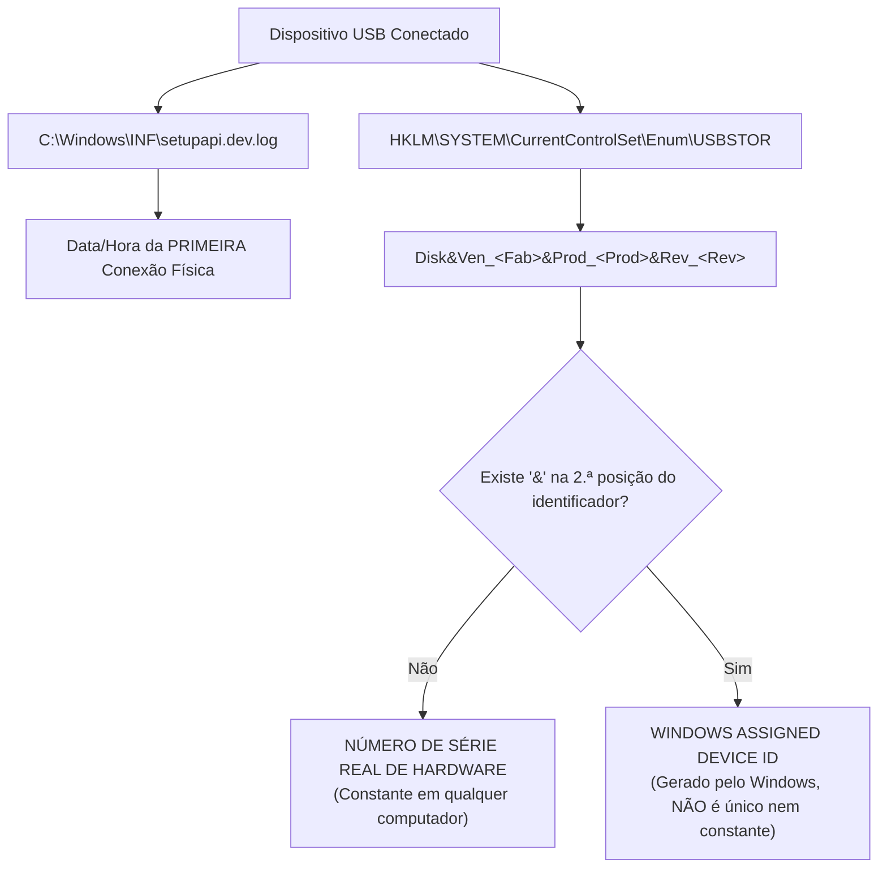

# Cheat Sheet — Windows Registry e Artefactos Forenses

> [!TIP] Finalidade desta Folha de Consulta Rápida
> Este documento condensa todos os caminhos físicos e lógicos, estruturas binárias, marcadores temporais, ferramentas e armadilhas periciais abordados nas 12 notas temáticas da pasta `05 - Registry e Forense`. Serve de guia de bolso para revisão rápida, resolução de desafios práticos e triagem em laboratório.

---

## 1. Mapeamento Físico vs. Lógico dos Hives

Num sistema em execução o Registry aparenta ser uma árvore única unificada, mas fisicamente está fragmentado em múltiplos ficheiros protegidos pelo *kernel* (**Configuration Manager**). 

Para compreender a sua arquitetura sem ambiguidades, importa distinguir três níveis bem demarcados:
1. **Vistas Virtuais / Atalhos em Memória**: Hives que não são ficheiros físicos, mas sim pontes dinâmicas criadas pelo SO na RAM (`HKCR`, `HKCU`, `HKCC`).
2. **Hives Lógicos Base**: As duas raízes estruturais permanentes (`HKLM` para o sistema global e `HKU` para os perfis de utilizador).
3. **Ficheiros Físicos no Disco**: Onde os dados residem permanentemente (divididos entre a pasta do sistema `\System32\config\` e a pasta de cada utilizador `C:\Users\<User>\`).



> [!NOTE] Desmistificando a "Fusão Virtual" do `HKCR` e as Vistas Dinâmicas
> * **Por que é que o `HKCR` não tem ficheiro físico no disco?**
>   O `HKCR` é uma vista composta sintetizada em tempo real pelo kernel para gerir tipos de ficheiros (`.pdf`, `.docx`, etc.) e registo de componentes COM. Quando o sistema consulta o `HKCR`, faz uma leitura em duas camadas:
>   1. **Base da Máquina**: Lê `HKLM\SOFTWARE\Classes` (gravado fisicamente no ficheiro `SOFTWARE` no disco).
>   2. **Sobreposição do Utilizador**: Lê `HKCU\Software\Classes` (gravado fisicamente no ficheiro `USRCLASS.DAT` do utilizador).
>   * **Regra de Prioridade Pericial**: Se existir uma definição personalizada no utilizador, **esta prevalece sobre a global**. Isto explica como um atacante sem privilégios de administrador consegue sequestrar associações de ficheiros (*File Association Hijacking*) gravando apenas no seu `USRCLASS.DAT`.
> * **Por que é que `HKCU` e `HKCC` são atalhos?**
>   * `HKCU` é apenas um apontador para a chave do utilizador com sessão aberta (`HKU\<SID>`), que foi carregada a partir do ficheiro `NTUSER.DAT`.
>   * `HKCC` é um apontador direto para o perfil de hardware corrente em `HKLM\SYSTEM\CurrentControlSet\Hardware Profiles\Current`.


### Tabela de Correspondência Direta

| Hive Lógico | Ficheiro Físico no Disco | Tipo / Carregamento | Conteúdo Principal |
| :--- | :--- | :--- | :--- |
| **`HKLM\SYSTEM`** | `%SystemRoot%\System32\config\system` | Estático / Boot | ControlSets, drivers, serviços, montagem de discos |
| **`HKLM\SAM`** | `%SystemRoot%\System32\config\sam` | Estático / Boot | Contas de utilizador locais e hashes de palavras-passe |
| **`HKLM\SECURITY`** | `%SystemRoot%\System32\config\security` | Estático / Boot | Políticas de segurança locais, LSA secrets, direitos |
| **`HKLM\SOFTWARE`** | `%SystemRoot%\System32\config\software` | Estático / Boot | Configurações globais de aplicações e do SO |
| **`HKU\.DEFAULT`** | `%SystemRoot%\System32\config\default` | Estático / Boot | Perfil padrão de sistema (`LocalSystem`) |
| **`HKCU`** | `C:\Users\<user>\NTUSER.DAT` | Dinâmico (Logon) | Preferências do utilizador, [[Artefacto Forense UserAssist\|UserAssist]], [[Artefactos Forenses de Interação do Utilizador (MRU e TypedPaths)\|RunMRU, RecentDocs]] |
| **`HKU\<SID>_Classes`** | `C:\Users\<user>\AppData\Local\Microsoft\Windows\USRCLASS.DAT` | Dinâmico (Logon) | Associações do utilizador, [[Artefacto Forense ShellBags\|ShellBags]], [[Artefactos Forenses de Execução e Persistência no Registry\|MuiCache]] |
| **`HKLM\HARDWARE`** | *(Nenhum — apenas em memória RAM)* | Volátil | Detetado dinamicamente pelo kernel no arranque |
| **`HKCC`** | *(Alias para `HKLM\SYSTEM\...\Hardware Profiles\Current`)* | Dinâmico | Perfil de hardware ativo |

> [!IMPORTANT] Chave `hivelist`
> Para auditar o mapeamento exato de hives para ficheiros físicos num sistema ativo:
> `HKLM\SYSTEM\CurrentControlSet\Control\hivelist`
> Consulta CLI: `reg query HKLM\SYSTEM\CurrentControlSet\Control\hivelist`

---

## 2. Matriz Mestre dos Artefactos Forenses do Registry

| Artefacto Forense | Ficheiro Hive | Caminho da Chave | O que Armazena | O que Prova | O que NÃO Prova |
| :--- | :--- | :--- | :--- | :--- | :--- |
| **[[Artefactos Forenses de Execução e Persistência no Registry\|Run / RunOnce]]** | `SOFTWARE` ou `NTUSER.DAT` | `...\Windows\CurrentVersion\Run` (e `RunOnce`) | Nomes de valores e linhas de comandos a arrancar no login | Configuração de persistência automática para programas | Não prova que o programa executou com sucesso (apenas que está configurado) |
| **[[Artefactos Forenses de Execução e Persistência no Registry\|LogonStats]]** | `NTUSER.DAT` | `HKCU\Software\Microsoft\Windows\CurrentVersion\Explorer\LogonStats` | `FirstLogonTime` em `SYSTEMTIME` binário (16 bytes) | Primeiro logon do utilizador na máquina ou na compilação atual | Não fornece histórico de logons intermédios |
| **[[Artefactos Forenses de Execução e Persistência no Registry\|MuiCache]]** | `USRCLASS.DAT` | `HKCU\Software\Classes\Local Settings\Software\Microsoft\Windows\Shell\MuiCache` | `.FriendlyAppName` e `.ApplicationCompany` de apps GUI | Existência prévia e invocação de app GUI pelo utilizador | Não guarda histórico de todas as execuções nem timestamps de fecho |
| **[[Artefactos Forenses de Execução e Persistência no Registry\|RecentApps]]** *(W10)* | `NTUSER.DAT` | `HKCU\Software\Microsoft\Windows\CurrentVersion\Search\RecentApps` | `AppPath`, `LaunchCount`, `LastAccessedTime` e até 10 `RecentItems` | Execuções e ficheiros abertos recentes em apps W10 | **Removido no W11**; acima de 10 ficheiros a ordenação alfabética quebra o FIFO |
| **[[Artefactos Forenses de Interação do Utilizador (MRU e TypedPaths)\|RunMRU]]** | `NTUSER.DAT` | `HKCU\Software\Microsoft\Windows\CurrentVersion\Explorer\RunMRU` | Valores alfabéticos (`a`, `b`...) com comandos e chave de ordem `MRUList` | Comandos digitados explicitamente na caixa `Win+R` | Não lista comandos lançados fora da caixa de diálogo Executar |
| **[[Artefactos Forenses de Interação do Utilizador (MRU e TypedPaths)\|RecentDocs]]** | `NTUSER.DAT` | `HKCU\Software\Microsoft\Windows\CurrentVersion\Explorer\RecentDocs` | Subchaves por extensão e ordem em `MRUListEx` (blocos de 4 bytes) | Ficheiros recentemente abertos/acedidos via Explorer | Não garante leitura completa do conteúdo do ficheiro |
| **[[Artefactos Forenses de Interação do Utilizador (MRU e TypedPaths)\|ComDlg32]]** | `NTUSER.DAT` | `HKCU\Software\Microsoft\Windows\CurrentVersion\Explorer\ComDlg32\` | `OpenSavePidlMRU` e `LastVisitedPidlMRU` | Ficheiros abertos/gravados em caixas de diálogo *Open/Save* e app que os abriu | Não cobre gravações feitas por linha de comandos |
| **[[Artefactos Forenses de Interação do Utilizador (MRU e TypedPaths)\|TypedPaths]]** | `NTUSER.DAT` | `HKCU\Software\Microsoft\Windows\CurrentVersion\Explorer\TypedPaths` | `url1`, `url2`... caminhos digitados na barra de endereços do Explorer | Intenção de navegar para diretórios locais, ocultos ou shares | Não regista navegação por duplo clique nas pastas |
| **[[Artefacto Forense UserAssist\|UserAssist]]** | `NTUSER.DAT` | `HKCU\Software\Microsoft\Windows\CurrentVersion\Explorer\UserAssist\{GUID}\Count` | Valores ofuscados em **ROT13**, bloco binário de 72 bytes por app | Execução de executáveis (`.exe`) e atalhos (`.lnk`) via GUI do Explorer | **Não regista execução via CLI (`cmd`/`powershell`)**, serviços ou tarefas agendadas |
| **[[Artefacto Forense ShellBags\|ShellBags]]** | `USRCLASS.DAT` *(W7-W11)* | `HKCU\Software\Classes\Local Settings\...\Shell\BagMRU` e `Bags` | Preferências de layout e árvore hierárquica de pastas e arquivos compactados | **Navegação visual** em pastas locais, shares, USB e arquivos (.zip/.7z/.rar) | **Não prova que ficheiros dentro da pasta tenham sido abertos ou lidos** |
| **[[Artefactos Forenses de Dispositivos USB\|USBSTOR]]** | `SYSTEM` | `HKLM\SYSTEM\CurrentControlSet\Enum\USBSTOR` | `Disk&Ven_...&Prod_...&Rev_...` e número de série / ID do dispositivo | Conexão de dispositivos de armazenamento amovível (fabricante, modelo, ID) | A data da chave não reflete necessariamente a primeira conexão física |
| **[[Registry em Aplicações Modernas (MSIX e Helium)\|Helium / MSIX]]** | `User.dat` *(App privada)* | `%LocalAppData%\Packages\<AppID>\SystemAppData\Helium\User.dat` | Registry virtualizado privado de apps MSIX (ex.: Bloco de Notas W11) | Ficheiros abertos em apps MSIX (isoladas de `NTUSER.DAT`) | Ficheiros abertos não surgem nos hives globais do utilizador |

---

## 3. Marcadores Temporais (Timestamps) & Estruturas Binárias

### Resumo dos Formatos Temporais no Windows

| Formato | Origem (EPOCH) | Granularidade / Unidade | Tamanho | Utilização no Windows | Conversão Rápida |
| :--- | :--- | :--- | :--- | :--- | :--- |
| **Microsoft FILETIME64** | **01/01/1601** 00:00:00 UTC | **100 nanossegundos** ($10^{-7}\text{ s}$) | 64 bits (`QWORD`) Little-Endian | Timestamps NTFS ($STANDARD_INFO), Registry, UserAssist | `w32tm.exe /ntte <valor>` |
| **UNIX Epoch** | **01/01/1970** 00:00:00 UTC | **Segundos** | 32 ou 64 bits | Logs de serviços, aplicações multiplataforma | CyberChef: *From UNIX Timestamp* |
| **WebKit / Chrome** | **01/01/1601** 00:00:00 UTC | **Microssegundos** ($10^{-6}\text{ s}$) | 64 bits | Bases SQLite de navegadores Chromium | `(WebKit / 1000000) - 11644473600` |
| **`SYSTEMTIME`** | Calendário gregoriano | Milissegundos | **128 bits (16 bytes)** (8x `WORD`) | `LogonStats`, perfis de rede (`DateCreated`) | Script Python / DCODE |

### Estrutura dos 16 Bytes de `SYSTEMTIME` (Win32)

Cada campo é um inteiro de 16 bits (`WORD` = 2 bytes) em **Little-Endian**:

```text
Offset (Bytes): [0-1]   [2-3]    [4-5]       [6-7]   [8-9]   [10-11]  [12-13]  [14-15]
Campo Win32:     Year   Month  DayOfWeek      Day    Hour    Minute   Second     MS
Exemplo Hex:    E4 07   08 00    01 00       1F 00   0B 00    15 00    1C 00    FF 00
Valor Decod.:   2020   Agosto   Segunda     Dia 31   11h      21m      28s     255ms
                ------------------------------------------------------------------------> 2020-08-31 11:21:28.255 UTC
```

### Estrutura dos 72 Bytes do Valor `Count` do UserAssist

Presente em `HKCU\...\UserAssist\{GUID}\Count`:

| Offset (Bytes) | Comprimento | Campo | Significado Pericial |
| :---: | :---: | :--- | :--- |
| `0–3` | 4 bytes | Session ID | Identificador de sessão de logon |
| `4–7` | 4 bytes | **Run Counter** | Contador de execuções (Little-Endian, inicia em 0) |
| `8–11` | 4 bytes | Focus Count | Número de vezes que a janela ganhou foco |
| `12–15` | 4 bytes | **Focus Time** | Duração total com janela em primeiro plano (em **milissegundos**) |
| `16–59` | 44 bytes | Dados Reservados | Estruturas não documentadas pela Microsoft |
| `60–67` | 8 bytes | **Last Execution Time** | Data/Hora da última execução em **FILETIME64** (Little-Endian) |
| `68–71` | 4 bytes | Preenchimento | Bloco constante de zeros (`0x00000000`) |

---

## 4. Dossiê Forense de Dispositivos USB



### Regra de Ouro: Serial Real vs. Windows Assigned ID

* **Número de Série Real de Fábrica**:
  * Formato alfanumérico uniforme **sem o caractere `&` na segunda posição** (ex.: `0707268153443174`).
  * Gravado no chip do controlador USB; **mantém-se idêntico** em qualquer computador onde o suporte seja inserido.
* **Windows Assigned Device ID**:
  * O identificador tem um **`&` na segunda posição** (ex.: `00045F057BD8BDC1D9C90033&0`).
  * Gerado localmente pelo Windows quando a pen não disponibiliza um número de série de hardware válido.
  * **Não é constante entre máquinas!** Duas máquinas diferentes gerarão códigos distintos para a mesmíssima pen.

### Ficheiros de Registo de Instalação (`setupapi.dev.log`)

* **Caminho**: `C:\Windows\INF\setupapi.dev.log` (e rotações históricas `setupapi.dev.YYYYMMDD_HHMMSS.log`).
* **Registo Chave**:
  ```text
  >>> [Device Install (Hardware initiated) - SWD\WPDBUSENUM\_??_USBSTOR#Disk&Ven_Lexar...#{...}]
  >>> Section start 2024/01/21 02:06:40.028
  ```
* **O que prova**: Determina a data e milissegundo exato da **primeira vez** que o dispositivo foi fisicamente encaixado na porta USB da máquina.

---

## 5. UserAssist & ShellBags: Peculiaridades Críticas

### 1. UserAssist
* **Hive**: `NTUSER.DAT`
* **GUIDs Estáticos Chave (Win 7 a 11)**:
  * `{CEBFF5CD-ACE2-4F4F-9178-9926F41749EA}` $\rightarrow$ Execução direta de ficheiro executável (`.exe`).
  * `{F4E57C4B-2036-45F0-A9AB-443BCFE33D9F}` $\rightarrow$ Execução a partir de atalho (`.lnk`).
* **Ofuscação**: Cifra **ROT13** (letras deslocadas em 13 posições):
  * `.exe` $\rightarrow$ `.RKR`
  * `.lnk` $\rightarrow$ `.YAX`
  * `notepad.exe` $\rightarrow$ `abgrcnq.rkr`
* **Armadilhas Forenses**:
  1. Apenas regista execuções desencadeadas pelo Explorador (`explorer.exe`). **Não audita** comandos lançados via CMD, PowerShell ou tarefas agendadas.
  2. A simples abertura de uma pasta no Explorador que contenha atalhos pode incrementar o contador `Run Counter` de certos `.lnk` **sem que o utilizador tenha clicado ou corrido a app** (falso positivo de execução!).

### 2. ShellBags
* **Hive**: `USRCLASS.DAT` (`C:\Users\<user>\AppData\Local\Microsoft\Windows\UsrClass.dat`)
* **Chaves**:
  * `BagMRU`: árvore de diretórios indexada com estruturas binárias `SHITEMID`.
  * `Bags`: definições gráficas de visualização (ícones, modo lista, ordenação).
* **Ficheiros Comprimidos (Novidade Windows 11 22H2)**:
  * O Explorador trata arquivos como pastas virtuais.
  * Formatos auditados: `.zip`, e desde a versão 22H2 também **`.7z`, `.rar`, `.tar`, `.tgz`, `.tbz2`, `.tzst` (ZStandard)**.
* **O que prova vs. O que não prova**:
  * **PROVA**: Que a shell do Windows renderizou a pasta para o utilizador (conhecimento de existência e ato de navegação em pastas locais, unidades amovíveis USB ou de rede, mesmo que entretanto apagadas).
  * **NÃO PROVA**: Abertura, leitura ou cópia dos ficheiros individuais contidos dentro dessa pasta.

---

## 6. Arquitetura 32 vs 64 bits & Identificação de Executáveis (PE)

### Nó `WOW6432Node`

* Em Windows de 64 bits, chaves de software nativo de 64 bits ficam em `HKLM\Software`.
* Chaves de software legado de 32 bits sofrem **redirecionamento** transparente para:
  `HKEY_LOCAL_MACHINE\Software\WOW6432Node`

> [!CAUTION] Cegueira de Ferramentas Forenses de 32 bits
> Ferramentas de análise forense compiladas em 32 bits que corram num SO de 64 bits são redirecionadas automaticamente pelo WOW64 para o `WOW6432Node`, ficando **cegas às chaves nativas de 64 bits** (a menos que usem `KEY_WOW64_64KEY`). Em triagem *live*, use sempre ferramentas nativas de 64 bits!

### Identificação de Arquitetura no Cabeçalho PE

Todo o executável tem cabeçalho DOS (`MZ` / `4D 5A`), ponteiro no offset `0x3C` para a assinatura PE (`PE\0\0` / `50 45 00 00`), e **4 bytes depois** encontra-se o campo `Machine` da estrutura `IMAGE_FILE_HEADER`:

| Arquitetura | Assinatura ASCII | Magic Bytes (Hex) | Constante PE SDK |
| :--- | :---: | :---: | :--- |
| **x86 (32 bits)** | `PE..L.` | `4C 01` | `IMAGE_FILE_MACHINE_I386` |
| **x64 / AMD64 (64 bits)** | `PE..d†` | `64 86` | `IMAGE_FILE_MACHINE_AMD64` |
| **ARM64 (Little-Endian)** | `PE....` | `64 AA` | `IMAGE_FILE_MACHINE_ARM64` (`AA64`) |

Comandos CLI:
* `exiftool.exe binario.exe` $\rightarrow$ inspecionar `File Type`, `PE Type` (PE32 vs PE32+) e `Machine Type`.
* `trid.exe binario.exe` $\rightarrow$ identificação heurística do compilador e empacotador (*packer*).

---

## 7. Aplicações Modernas (MSIX / Helium)

* **Contentorização**: Aplicações empacotadas em **MSIX** (Microsoft Store) não escrevem no `NTUSER.DAT` tradicional.
* **Pasta `Helium`**: Mantêm hives privados e virtualizados em:
  `%LocalAppData%\Packages\<APPID>\SystemAppData\Helium\`
* **Ficheiro Central**: **`User.dat`** (e ficheiros transacionais `User.dat.LOG1` / `.LOG2`).
* **Caso Prático**: No Windows 11, o **Bloco de Notas (Notepad)** armazena a lista de ficheiros recentemente abertos exclusivamente em:
  `...\Packages\Microsoft.WindowsNotepad_8wekyb3d8bbwe\SystemAppData\Helium\User.dat`
  Sob a chave: `Software\Microsoft\Windows\CurrentVersion\Explorer\ComDlg32\OpenSavePIDMru`
* **Impacto Pericial**: Analisar apenas os hives padrão resulta em **falsos negativos** sobre a atividade em apps modernas.

---

## 8. Salvaguarda, Auditoria e Monitorização

### 1. O Fim do `RegBack` Automático
* Histórico: `C:\Windows\System32\config\RegBack\` continha cópias dos hives a cada 10 dias via tarefa `RegIdleBackup`.
* **Alteração Crítica**: Desde o **Windows 10 v1803**, a Microsoft **desativou** o backup por defeito. Os ficheiros existem mas têm tamanho **0 KB**!
* Reativação: Requer a criação do valor DWORD `EnablePeriodicBackup = 1` sob:
  `HKLM\System\CurrentControlSet\Control\Session Manager\Configuration Manager`

### 2. Sysmon (System Monitor) vs. Procmon
* **Procmon**: Análise dinâmica interativa; regista em memória em tempo real.
* **Sysmon**: Serviço persistente + driver de kernel; regista continuamente no Windows Event Log:
  `Applications and Services Logs\Microsoft\Windows\Sysmon\Operational`
* **Event IDs do Sysmon para o Registry**:
  * **Event ID 12**: Criação ou eliminação de chaves e valores (*Object create and delete*).
  * **Event ID 13**: Alteração do dado de um valor (*Value Set*).
  * **Event ID 14**: Mudança de nome de chaves ou valores (*Key and Value Rename*).

---

## 9. Tipos de Dados do Registry

| ID | Tipo de Dado | Significado | Exemplo Típico |
| :---: | :--- | :--- | :--- |
| **`0`** | `REG_NONE` | Sem tipo definido | Dados brutos não tipificados de aplicações |
| **`1`** | `REG_SZ` | String de texto terminada em nulo | Caminhos de ficheiros, descrições, `MRUList` |
| **`2`** | `REG_EXPAND_SZ` | String com variáveis de ambiente não expandidas | `%SystemRoot%\System32\cmd.exe` |
| **`3`** | `REG_BINARY` | Dados binários de dimensão arbitrária | Bloco de 72 bytes de UserAssist, `MRUListEx` |
| **`4`** | `REG_DWORD` | Inteiro de 32 bits (Little-Endian) | Contadores, portas, booleanos (`0` ou `1`) |
| **`5`** | `REG_DWORD_BIG_ENDIAN` | Inteiro de 32 bits (Big-Endian) | Raro, usado em compatibilidade UNIX/rede |
| **`6`** | `REG_LINK` | Ligação simbólica Unicode para outra chave | Redirecionamentos internos do Registry |
| **`7`** | `REG_MULTI_SZ` | Vetor de strings terminadas em `\0` (fecha com `\0\0`) | Listas de drivers, dependências de serviços |
| **`11`** | `REG_QWORD` | Inteiro de 64 bits (Little-Endian) | Timestamps FILETIME64 de alta precisão |

---

## 10. Cheat Sheet de Comandos CLI (Guia de Terminal)

### Interrogação e Exportação Nativa (`reg.exe`)
```cmd
REM Consultar valor específico
reg query "HKLM\SYSTEM\CurrentControlSet\Control\hivelist"

REM Consulta recursiva filtrando por subchaves de caminhos digitados
reg query "HKCU\Software\Microsoft\Windows\CurrentVersion\Explorer\TypedPaths" /s

REM Exportar chave para ficheiro de texto regedit v5.00
reg export "HKCU\Software\Microsoft\Windows\CurrentVersion\Explorer\RunMRU" run_mru.txt
```

### Associações de Ficheiros (`assoc` e `ftype`)
```cmd
REM Verificar o tipo associado a uma extensão
assoc .txt
REM Resultado: .txt=txtfilelegacy

REM Verificar a linha de comandos executada para o tipo de ficheiro
ftype | findstr /i "vlc"
REM Resultado: VLC.mp3="C:\Program Files\VideoLAN\VLC\vlc.exe" --started-from-file "%1"
```

### Conversão de Timestamps e Auditoria USB
```cmd
REM Converter valor decimal FILETIME64 para data/hora UTC legível
w32tm.exe /ntte 132487968980000000

REM PowerShell: Listar unidades de armazenamento USB com PNPDeviceID e Serial
gwmi win32_diskdrive | ? {$_.interfacetype -eq 'USB'} | Select-Object model, pnpdeviceID, serialnumber
```

### Ferramentas Forenses Especializadas
```bash
# RegRipper: Executar plugin userassist sobre hive NTUSER.DAT offline
./rip.exe -r C:\Forensics\NTUSER.DAT -p userassist

# RegRipper: Auditoria completa a um hive SYSTEM
./rip.exe -r C:\Forensics\SYSTEM -f system

# SBECmd: Extrair e converter ShellBags de UsrClass.dat para CSV
sbecmd.exe -d C:\Forensics\UsrClass.dat --csv C:\Forensics\Relatorios_ShellBags

# Sysmon: Consultar configuração ativa e instalar novo perfil XML
sysmon.exe -c
sysmon.exe -accepteula -i sysmonconfig-export.xml
```

---

## 11. "Top 7" Armadilhas Forenses do Capítulo (Perguntas Típicas de Exame)

> [!CAUTION] Os 7 Erros Mais Comuns em Perícia do Registry
> 
> 1. **Assumir que o UserAssist prova o clique do utilizador**: A abertura no Explorador de uma pasta com dezenas de ficheiros `.lnk` pode incrementar o contador `count` desses atalhos sem que nenhum tenha sido executado.
> 2. **Procurar execuções de PowerShell/CMD no UserAssist**: O UserAssist regista apenas ações desencadeadas na interface gráfica (`explorer.exe`). Linhas de comandos e serviços nunca entram nesta chave.
> 3. **Confundir Device ID gerado pelo Windows com Número de Série Real**: Se o segundo caractere do ID em `USBSTOR` for um `&`, o número foi inventado pelo Windows porque o hardware não tem serial. Esse número mudará noutra máquina.
> 4. **Tratar os ShellBags como prova de leitura de ficheiros**: Os ShellBags provam unicamente a visualização e navegação no **contentor (pasta)**. Não provam que os documentos lá dentro tenham sido abertos.
> 5. **Confiar na cronologia dos últimos 10 itens do `RecentApps` no Windows 10**: Ao atingir 10 ficheiros, a substituição não é FIFO estrito; os elementos remanescentes ordenam-se alfabeticamente.
> 6. **Presumir que o `RegBack` contém uma cópia utilizável dos hives**: A partir do Windows 10 v1803, os ficheiros em `System32\config\RegBack\` estão a 0 KB por omissão.
> 7. **Executar ferramentas periciais de 32 bits em sistemas de 64 bits**: O subsistema WOW64 redireciona transparentemente as consultas para `WOW6432Node`, deixando o perito totalmente cego ao espaço de 64 bits.

---

## Navegação

- [[Capítulo 1 - Sistemas Operativos, Serviços e Artefactos Forenses|Voltar ao Índice do Capítulo 1]]
- [[Estrutura e Hives do Windows Registry]]
- [[Tipos de Dados e Associação de Ficheiros no Registry]]
- [[Arquitetura 32 vs 64 bits no Registry e Executáveis (WOW6432Node)]]
- [[Artefacto Forense ShellBags]]
- [[Artefacto Forense UserAssist]]
- [[Artefactos Forenses de Dispositivos USB]]
- [[Artefactos Forenses de Execução e Persistência no Registry]]
- [[Artefactos Forenses de Interação do Utilizador (MRU e TypedPaths)]]
- [[Ferramentas de Análise e Extração do Registry]]
- [[Marcadores Temporais no Windows (Timestamps)]]
- [[Registry em Aplicações Modernas (MSIX e Helium)]]
- [[Salvaguarda e Monitorização do Registry]]
